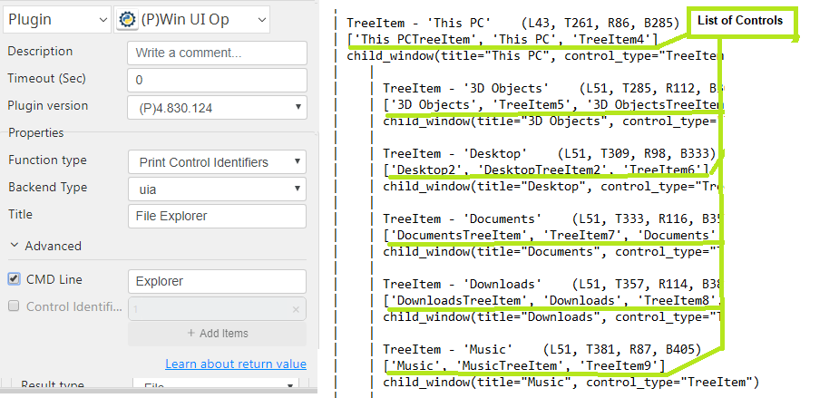
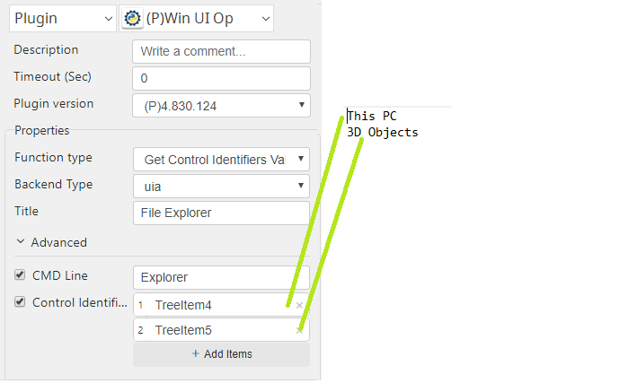

# Win UI Op

***Win UI Op with this plug-in can print all controllers on the windows interface and retrieve the value needed.***

## Win UI Op
| Item         |          Value           |
|--------------|:------------------------:|
| Icon         |    |
| Display Name |      **Win UI Op**       |

### Arun Kumar (arunk@argos-labs.com)

Arun Kumar
* [email](mailto:arunk@argos-labs.com) 
 
## Version Control 
* [4.829.1100](setup.yaml)
* Release Date: `August 29, 2022`

## Input (Required)
| Parameters               | Output                   |
|--------------------------|--------------------------|
| CMD Line                 | Control Identifiers:     |
| Title                    |                          |
| CMD Line                 | Control Identifier Value |
| Title                    |                          |
| Control Identifier Name  |                          |

:warning: **If Control Identifier Value already has comma separated**: deal it separately!

## Return Value

### Normal Case
Description of the output result

## Return Code
| Code | Meaning                      |
|------|------------------------------|
| 0    | Success                      |
| 1    | Exceptional case             |

## Output Format
You may choose one of 3 output formats below,

<ul>
  <li>String (default)</li>
  <li>CSV</li>
  <li>File</li>
</ul>  

## Parameter setting examples (diagrams)

## Operations

###  Print Control Identifiers:

### Print Control Identifiers Value:

